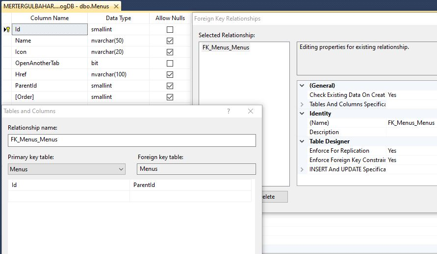
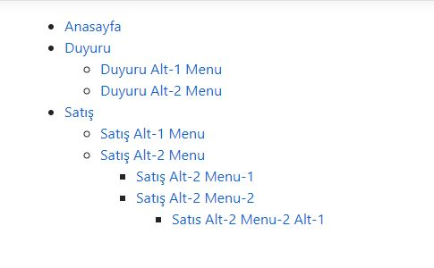
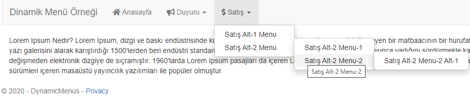

*Bu örneği Visual Studio 2019 ve .NET Core 3.1 kullanılarak hazırladım. Veritabanı olarak MSSQL kullandım.*

## Menü Tablosu Dizaynı ve İlişkisi


## Menü tablosundaki örnek veriler


## Menü ViewModel'in Oluşturulması
```csharp
public class MenusVM
    {
        public short Id { get; set; }
        public short? ParentId { get; set; }
        public string Name { get; set; }
        public string Href { get; set; }
        public short? Order { get; set; }
        public string Icon { get; set; }
        public bool OpenAnotherTab { get; set; }

        public List<MenusVM> SubMenus { get; set; }
        
    }
```
## Controller Tarafında Mapping Yapılması
Index fonksiyonunda **InverseParent**'ı include ederek tüm alt menüleri de çekiyoruz. InverseParent özelliği menü tablomuzda ParentId' yi tablonun Id'si ile ilişkilendirdiğizde entity framework aracılığıyla oluşur.
**Foreach** içine sadece ParentId' si **null** olanları alıyoruz. Diğerlerini recursive olarak alacağız. **InverseParent.Count > 0** yani alt menü varsa alt menüleri de map ediyoruz.
```csharp
public class HomeController : Controller
{
    private readonly GithubBlogDBContext _context;

    public HomeController(GithubBlogDBContext context)
    {
        _context = context;
    }

    public IActionResult Index()
    {
        var menus = _context.Menus
        .Include(m=>m.InverseParent)
        .OrderBy(m => m.Order)
        .ToList();

        var menuListVM = new List<MenusVM>();
        foreach (var menu in menus.Where(m => m.ParentId == null))
        {
            menuListVM.Add(new MenusVM
            {
                Id = menu.Id,
                ParentId = menu.ParentId,
                OpenAnotherTab = menu.OpenAnotherTab,
                Href = menu.Href,
                Icon = menu.Icon,
                Name = menu.Name,
                Order = menu.Order,
                SubMenus = menu.InverseParent.Count > 0
                        ? mapToViewModel(menu.InverseParent.ToList())
                        :new List<MenusVM>()
            });
        }
        ViewBag.Menus = menuListVM;
        return View();
    }
}

```

## Alt Menüleri Recursive Olarak Map'leme
Burada alt menüleri eklemek için bir liste oluştuyoruz. Sonra bu listeyi yukarıdaki fonksiyondaki 
**SubMenus**'e dönüyoruz.
```csharp
    private List<MenusVM> mapToViewModel(List<Menus> menuList)
    {
        var subMenus = new List<MenusVM>();

        foreach (var menu in menuList)
        {
            subMenus.Add(new MenusVM
            {
                Id = menu.Id,
                ParentId = menu.ParentId,
                OpenAnotherTab = menu.OpenAnotherTab,
                Href = menu.Href,
                Icon = menu.Icon,
                Name = menu.Name,
                Order = menu.Order,
                SubMenus = menu.InverseParent.Count > 0
                        ? mapToViewModel(menu.InverseParent.ToList())
                        : new List<MenusVM>()
            });
        }
        return subMenus.OrderBy(x => x.Order).ToList();
    }

```
Şuan veritabanındaki menüleri çekmiş olduk. Mapping işlemini kendimiz yaptık. Harici bir kütüphane de kullanılabilir fakat recursive fonksiyonun kullanımını görmek açısından bu yolu tercih ettim.
Menümüzü UI kısmında görmek için direkt html içine kodlarımızı yazabiliriz fakat ben bu örnekte helper kullanacağım. Böylece html sayfamız daha temiz gözükecektir.

## Menu Helper' ın Oluşturulması

```csharp
[HtmlTargetElement("TopMenu")] //html elementimizin adı
public class MenuHelper : TagHelper
{
    private const string OPEN_UL = "<ul>";
    private const string CLOSE_UL = "</ul>";
    private const string OPEN_LI = "<li>";
    private const string CLOSE_LI = "</li>";
    public List<MenusVM> Menus { get; set; } //UI kısmında html özelliği gibi çalışacak. public olmalı

    public override void Process(TagHelperContext context, TagHelperOutput output)
    {
        output.Content.SetHtmlContent(CreateMenu()); //html içeriğimizi ayarlıyoruz.
        base.Process(context, output);
    }
```
## Ana Menü Oluşturma Fonksiyonu
Controller tarafından ViewBag'a menü listemizden **ParentId** 'si **null** olanlar göndermiştik. 
Bir tane **StringBuilder** tanımlıyoruz ve onu ortak olarak kullanıyoruz. Yani tüm html elemanları onun içinde olacak. **SubMenus.Count > 0** ise alt menüleri ekleme fonksiyonuna gidiyoruz.
```csharp

private string CreateMenu()
{
    var strBuilder = new StringBuilder();
    strBuilder.Append(OPEN_UL);
    foreach (var menu in Menus)
    {
        string target = menu.OpenAnotherTab ? "_blank" : "";
        string icon = menu.Icon != null ? "<i class=" + menu.Icon + "></i>" : string.Empty;
        string href = menu.Href ?? "#";

        strBuilder.Append(OPEN_LI);
        strBuilder.Append("<a title='"+menu.Name+"' target='"+target+"' href='"+href+"'>"+icon+" "+menu.Name+"</a>");
        if (menu.SubMenus.Count > 0)
            AddSubMenu(menu.SubMenus, strBuilder);
        
        strBuilder.Append(CLOSE_LI);
    }
    strBuilder.Append(CLOSE_UL);
    return strBuilder.ToString();
}
```

## Alt Menüleri Üst Menüye Ekleme Fonksiyonu
Alt menünün de alt menüsü varsa bunları da **StringBuilder** eklemek için recursive olarak çalışıyor.
```csharp
private void AddSubMenu(List<MenusVM> submenus, StringBuilder strBuilder)
{
    strBuilder.Append(OPEN_UL);
    foreach (var submenu in submenus)
    {
        string target = submenu.OpenAnotherTab ? "_blank" : "";
        string icon = submenu.Icon != null ? "<i class=" + submenu.Icon + "></i>" : string.Empty;
        string href = submenu.Href ?? "#";

        strBuilder.Append(OPEN_LI);
        strBuilder.Append("<a title='" + submenu.Name + "' target='" + target +"' href='" + href + "'>" + icon + " " + submenu.Name + "</a>");
        if (submenu.SubMenus.Count > 0)
            AddSubMenu(submenu.SubMenus, strBuilder);

        strBuilder.Append(CLOSE_LI);
    }
    strBuilder.Append(CLOSE_UL);
}
```
## Html Sayfasında MenuHelper'ın Çağırılması
*_ViewImports.cshtml dosyasına **@addTagHelper *, DynamicMenus** diyerek projeyi import etmeyi unutmayın.*
Index.cshtml sayfamızın içeriği aşağıdaki gibidir.

```csharp
@{   
    var menuList = ViewBag.Menus as List<MenusVM>;
}
<TopMenu menus="@menuList"> </TopMenu>

```

## Html Sayfamızın Çıktısı


## Bootstrap-3 Ekleme
Tasarımı güzelleştirmek için bootstrap kütüphanesini kullandım. Bu <a href="https://bootsnipp.com/snippets/kM4Q" target="_blank">adresteki</a> multi-level menüden yararlandım.
```csharp
[HtmlTargetElement("TopMenu")]
public class MenuHelper : TagHelper
{
    public List<MenusVM> Menus { get; set; }

    public override void Process(TagHelperContext context, TagHelperOutput output)
    {
        output.Content.SetHtmlContent(CreateMenu());
        base.Process(context, output);
    }

    private string CreateMenu()
    {
        var strBuilder = new StringBuilder();
        strBuilder.Append("<nav class='navbar navbar-default'><div class='container-fluid'>");
        strBuilder.Append("<div class='navbar-header'><a class='navbar-brand' href='#'>Dinamik Menü Örneği</a></div>");
        strBuilder.Append("<ul class='nav navbar-nav'>");

        foreach (var menu in Menus)
        {
            string target = menu.OpenAnotherTab ? "_blank" : "";
            string icon = menu.Icon != null ? "<i class='" + menu.Icon + "'></i>" : string.Empty;
            string href = menu.Href ?? "#";
            
            if (menu.SubMenus.Count > 0)
            {
                strBuilder.Append("<li class='dropdown'>");
                strBuilder.Append("<a title='" + menu.Name + "' class='dropdown-toggle' data-toggle='dropdown'  href='#'> "+icon+ " " + menu.Name + " <span class='caret'><span></a>");

                AddSubMenu(menu.SubMenus, strBuilder);
            }
            else 
            { 
                strBuilder.Append("<li>");
                strBuilder.Append("<a title='" + menu.Name + "' target='" + target + "' href='" + href + "'>" + icon + " " + menu.Name + "</a>");
            }
            strBuilder.Append("</li>");
        }
        strBuilder.Append("</ul></div></nav>");
        return strBuilder.ToString();
    }

    private void AddSubMenu(List<MenusVM> submenus, StringBuilder strBuilder)
    {
        strBuilder.Append("<ul class='dropdown-menu'>");
        foreach (var submenu in submenus)
        {
            string target = submenu.OpenAnotherTab ? "_blank" : "";
            string icon = submenu.Icon != null ? "<i class=" + submenu.Icon + "></i>" : string.Empty;
            string href = submenu.Href ?? "#";

            if (submenu.SubMenus.Count > 0)
            {
                strBuilder.Append("<li class='dropdown-submenu'>");
                strBuilder.Append("<a title='" + submenu.Name + "'  href='#'>" + submenu.Name + "</a>");

                AddSubMenu(submenu.SubMenus, strBuilder);
            }  
            else
            {
                strBuilder.Append("<li >");
                strBuilder.Append("<a title='" + submenu.Name + "' target='" + target + "' href='" + href + "'>" + icon + " " + submenu.Name + "</a>");
            }

            strBuilder.Append("</li>");
        }
        strBuilder.Append("</ul>");
    }
}

```
## Html Sayfamızın Yeni Çıktısı


Kaynaklar: 
<br/>
*https://www.niceonecode.com/Blog/40/Generating-Multi-Level-Menu-through-Recursion-in-CSharp*

---