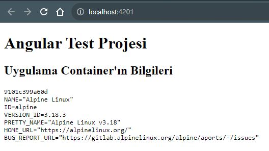

# Docker Container'da Çalışan Bir Angular Uygulamasından Container Bilgilerine Erişmek

## Problem ##

Bir web uygulaması, birden fazla container'da dağıtık olarak çalışabilir. Bu dağıtık yapının bir sonucu olarak, bir web tarayıcısından bir uygulamaya eriştiğimizde, bu uygulamanın hangi container'dan bize sunulduğunu belirlemek gerekebilir. Özellikle uygulamanın veya sistemin test edilmesi sırasında bu bilgi önemli olabilir. 
Bu durumda, container'ın bilgilerine erişmemiz gerekir. Backend uygulamaları için bu bilgilere erişmek genellikle kolaydır, ancak frontend uygulamaları için durum farklıdır çünkü frontend uygulamaları genellikle işletim sistemine doğrudan erişemez. 

Peki frontend tarafında bu işi nasıl yaparız? 

## Senaryo ##

1. Uygulamayı bir linux dağıtımı üzerine inşa edilmiş bir nginx docker image'ı üzerinden sunacağız.
2. Uygulama ayağa kalkmadan önce linux komutları ile container bilgilerine erişeceğiz.
3. Bu bilgileri bir .txt uzantılı dosyaya yazacağız. 
4. Uygulama ayağa kalktığında .txt uzantılı dosyayı okuyup container bilgilerine erişeceğiz.


## Çözüm ##

### Angular Frontend Uygulaması ###

  1. Uygulamadan **src/assets/** yoluna gidelim ve burada **hostname.txt** isimli dosya oluşturalım.
  2. Aşağıdaki gibi _**HostNameService**_ isimli bir service oluşturalım.

```typescript
import {HttpClient} from "@angular/common/http";
import {Injectable} from "@angular/core";
import { Observable } from "rxjs";


@Injectable()

export class HostNameService{
  private readonly hostNamePath = "./assets/hostname.txt";
  constructor(private http: HttpClient) {}

  public getHostName(): Observable<string> {
    return this.http.get(this.hostNamePath, { responseType: 'text' });
  }

}
```

  3. _**HostNameService**_ isimli servisimize erişmek için aşağıdaki gibi _**Home**_ isimli bir component oluşturalım.
 
```typescript
import { Component, OnInit } from '@angular/core';
import { HostNameService } from '../services/hostname-service';

@Component({
  selector: 'app-home',
  templateUrl: './home.component.html',
  styleUrls: ['./home.component.css']
  })
  export class HomeComponent implements OnInit {
  constructor(private hostNameService: HostNameService) {}

  hostName: string = "";
  
  ngOnInit() {
    
    this.hostNameService.getHostName().subscribe((hn) => {
      this.hostName = hn;
    });
  }
```
4. _**home.component.html**_ sayfasından _**hostname**_ değişkenine erişiyoruz.

```html
<div *ngIf="hostName"> 
    <h2>Uygulama Container'ın Bilgileri</h2>
    <pre >{{hostName}}</pre>
</div>
```

Uygulamanın angular tarafında yapacağımız işlem kalmadı. Şimdi linux shell için bir betik oluşturalım.

5. Uygulamanın ana dizininde _**hostname.sh**_ isimli bir dosya oluşturalım. Aşağıdaki kodu bu dosyaya ekleyelim.

```shell
# container_id
echo "$HOSTNAME" > /usr/share/nginx/html/assets/hostname.txt
# os bilgileri
echo "$(cat /etc/os-release)" >> /usr/share/nginx/html/assets/hostname.txt
/usr/sbin/nginx -g "daemon off;"
```

6. Uygulamamız için bir Dockerfile dosyası oluşturalım ve aşağıdaki kodu bu dosyaya kopyalayalım.

```Dockerfile
# Stage 1
FROM node:lts-alpine3.18 as build-step
WORKDIR /app
COPY package.json /app
RUN npm install
COPY . /app
RUN npm run build_prod

# Stage 2
FROM nginx:mainline-alpine-slim
COPY --from=build-step /app/dist/angular /usr/share/nginx/html
COPY hostname.sh /hostname.sh
CMD ["sh", "/hostname.sh"]
```

7. Uygulamayı ayağa kaldıralım.

Docker Image Oluşturma

```shell
docker build -t ng-test .
```

Docker Container'ı Çalıştırma
```shell
docker run --name ng-test-cont -dit -p 4201:80 ng-test
```

8. Sonuç




